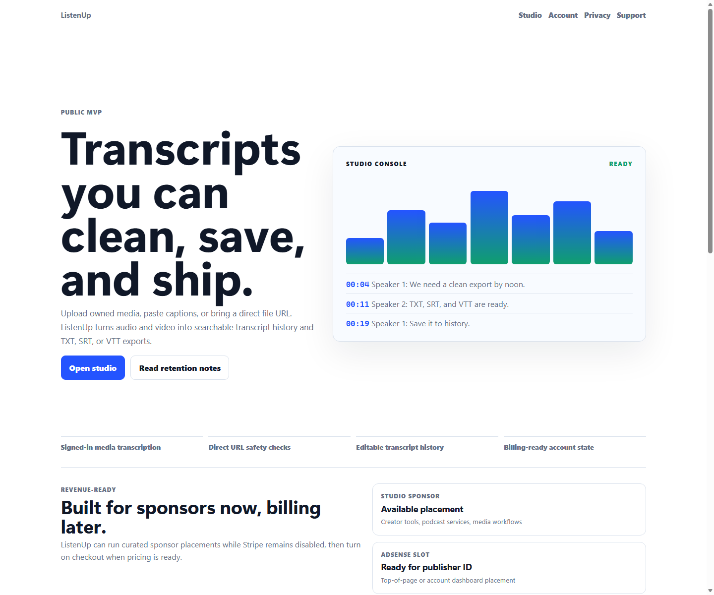
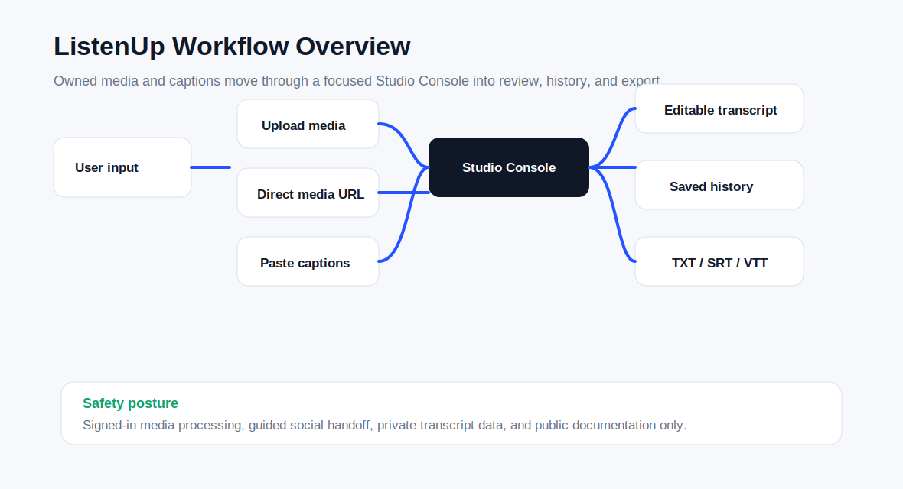
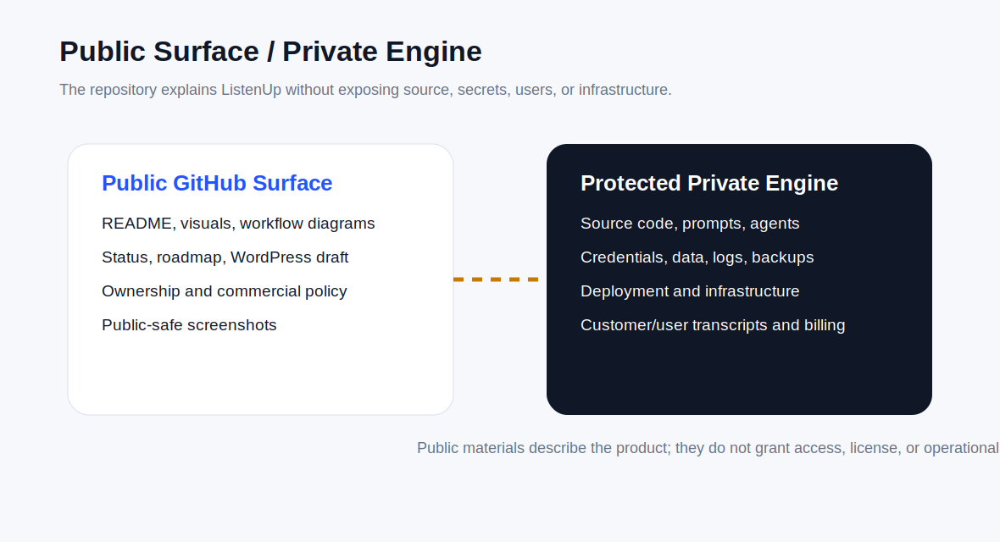
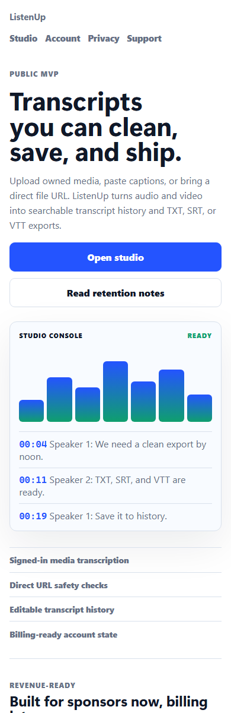
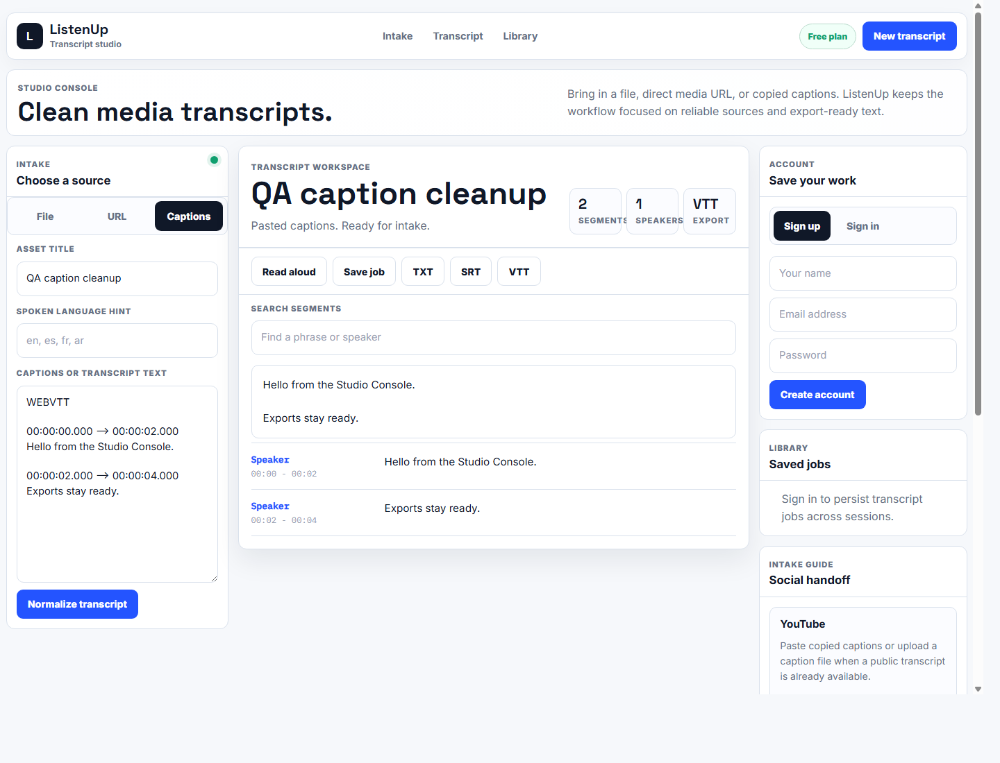
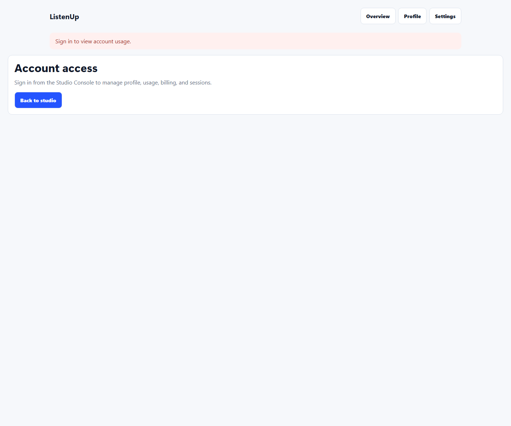
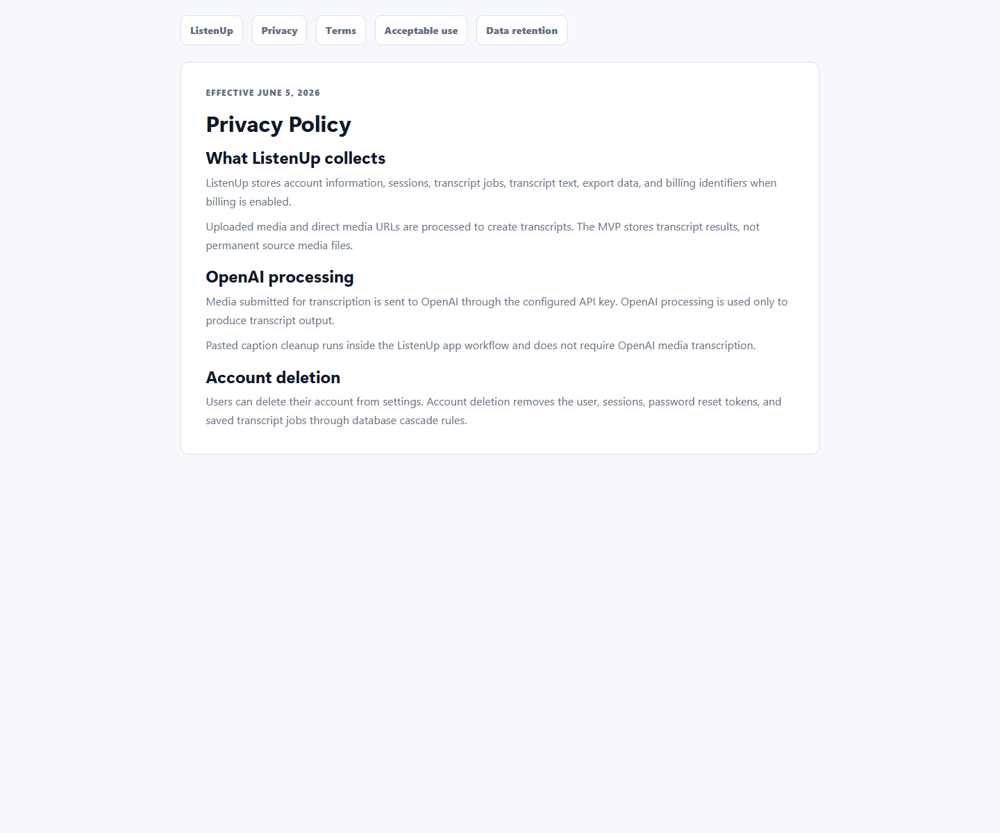
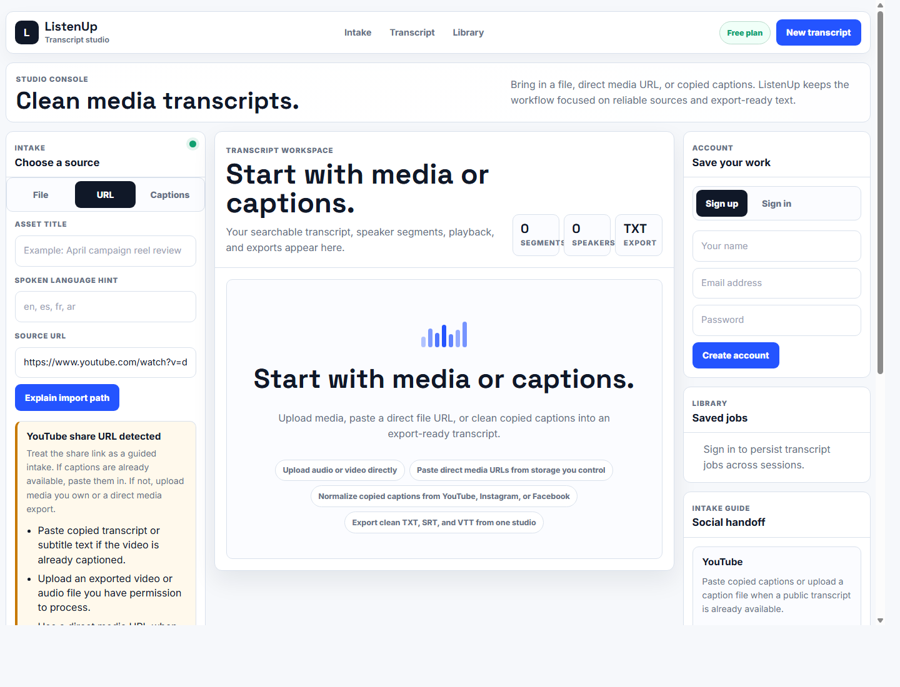

# ListenUp

ListenUp is a transcription and caption studio for turning owned audio, video, direct media files, and pasted captions into clean, searchable transcript output.

This repository is a protected public project surface. It is not the full source code, operational system, private workflow, or data room.

## Why It Matters

Media teams, creators, advocates, researchers, and small businesses often need transcripts that are more useful than a raw dump. ListenUp focuses on a practical workflow: bring media or captions in, clean the text, review the timing, save the transcript, and export usable TXT, SRT, or VTT files.

## Who It Is For

- Creators who need cleaner captions and transcript history.
- Podcast, video, and media teams that need export-ready text.
- Operators who want a safer workflow for owned media.
- Teams that need a public product surface while protecting the engine behind it.

## How It Works

1. Upload owned media, paste a direct media URL, or paste existing captions.
2. Use the Studio Console to normalize, review, search, and edit transcript text.
3. Save transcript history behind an account.
4. Export TXT, SRT, or VTT files.
5. Keep private workflows, user data, credentials, and deployment systems outside the public repository.

## Public And Private Boundary

Public here means project story, status, visuals, workflow diagrams, ownership language, and launch materials. Private means source code, prompts, credentials, customer data, private workflows, operational infrastructure, and deployment systems.

## Current Status

ListenUp is locally launch-ready as a product surface. The private app has passed local lint, typecheck, build, runtime smoke, and visual QA checks. Oceanic deployment and live billing activation remain private operational work.

## OpenAI Build Week 2026

ListenUp now has a public interactive contest showcase and a narrated
two-minute product tour. The showcase demonstrates the synthetic judge sample
and the structured Transcript Brief without exposing user data, credentials,
private source, or an unmetered model endpoint.

- [Try the interactive showcase](https://listenup-buildweek.indigo-iris-5804.chatgpt.site)
- [Watch or download the narrated demo](https://github.com/thefayth/listenup/releases/tag/build-week-2026-demo)

The contest work adds a typed GPT-5.6 Transcript Brief for summaries, themes,
actions, quotes, chapters, follow-up questions, and plain-language output.

## Visual Gallery

## Canva Launch Graphic

The launch social graphic is available as a Canva-ready design for resizing into social posts, banners, and campaign cards:
[Minimalist Media Workstation Banner with ListenUp](https://www.canva.com/d/QkBPUu6OrW2EY5d).

| Studio | Mobile | Transcript |
|---|---|---|
|  |  |  |

| Account | Policy | Unsupported Link |
|---|---|---|
|  |  |  |

## Ownership

ListenUp is created and owned by Faith Cheltenham / The Fayth.

All rights reserved. No source release is granted by this repository. No public license, redistribution, training, commercial reuse, or implied permission is granted.

## Learn More

- Project brief: [docs/PROJECT_BRIEF.md](docs/PROJECT_BRIEF.md)
- Status: [docs/STATUS.md](docs/STATUS.md)
- Roadmap: [docs/ROADMAP.md](docs/ROADMAP.md)
- Public/private boundary: [docs/PUBLIC_PRIVATE_BOUNDARY.md](docs/PUBLIC_PRIVATE_BOUNDARY.md)
- Canva asset plan: [docs/CANVA_ASSET_PLAN.md](docs/CANVA_ASSET_PLAN.md)
- WordPress draft: [wordpress/page.md](wordpress/page.md)
- Build Week demo: [build-week-2026-demo release](https://github.com/thefayth/listenup/releases/tag/build-week-2026-demo)
